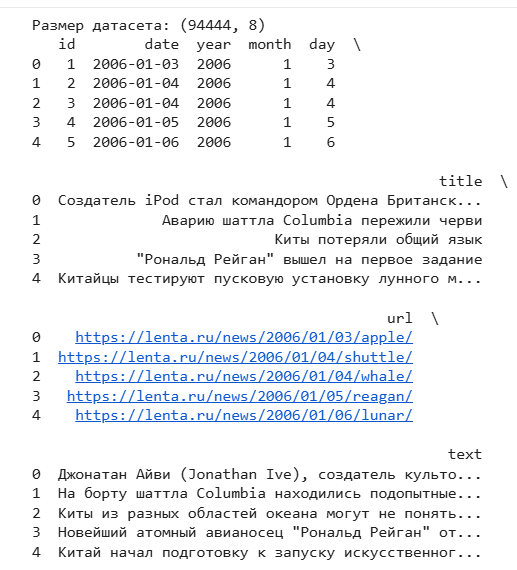
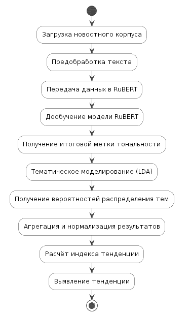
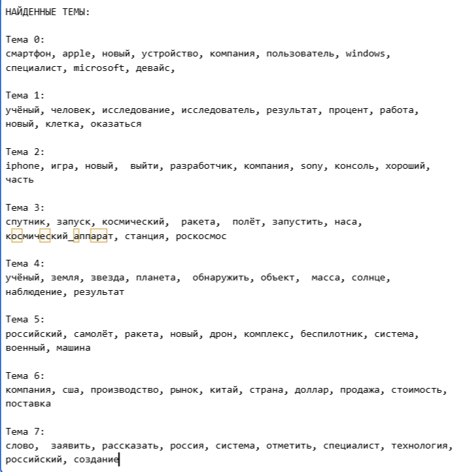
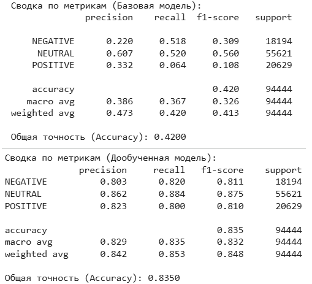
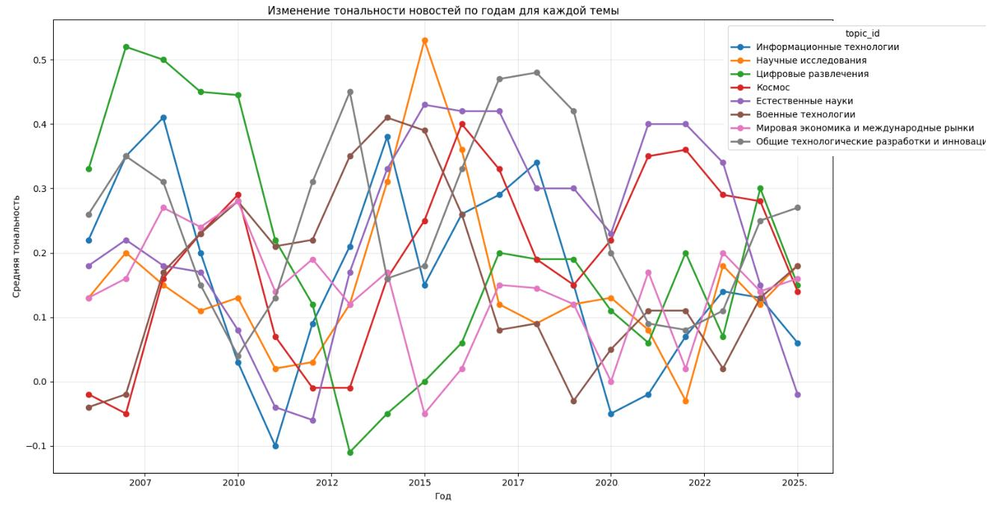
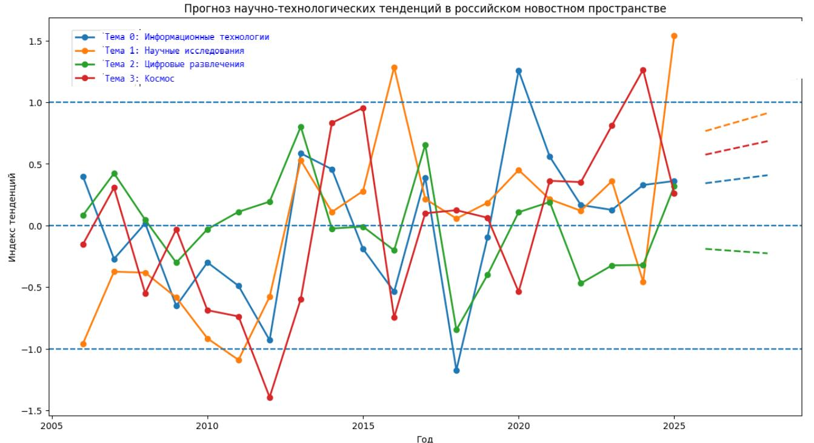
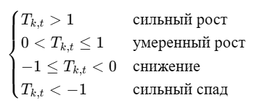
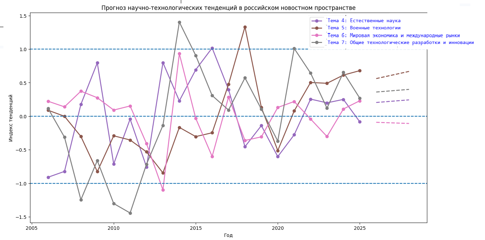

## Страница 1

Формулировка исследовательской задачи модели
• Цель исследования — разработка модели интеллектуального анализа 
тональности новостных потоков для выявления научно-
технологических тенденций в российском информационном 
пространстве на основе трансформерных моделей и методов обработки 
текстовых данных.
• На вход системы поступают новостные публикации, извлекаемые из 
открытых источников. На выходе формируются оценки тональности 
сообщений, тематические распределения и агрегированные показатели, 
используемые для анализа динамики научно-технологических 
направлений.
• Для достижения цели реализованы этапы: сбор данных, предобработка 
текстов, классификация тональности с использованием дообученной
трансформерной модели, а также последующий анализ результатов, 
включая тематическое моделирование и выявление тенденций.
4

## Страница 2

Анализ и характеристика входных данных
5
Название 
признака
Описание
Тип данных
id
уникальный 
идентификатор записи
Целочисленный
date
дата публикации 
новости
Дата
year
Год публикации 
новости
Целочисленный
month
Месяц публикации 
новости
Целочисленный
day
День публикации 
новости
Целочисленный
title
Заголовок новости
Текстовый
url
Ссылка на 
оригинальную 
страницу новости
Текстовый
text
Основной текст 
новостного материала
Текстовый
Таблица 2 — Входные данные
Рисунок 1 — Пример первых строк

## Страница 3

Описание этапов разработки модели
• Сбор данных: выполнен автоматический сбор новостных публикаций научно-
технологической тематики с использованием собственного веб-парсера, извлекающего 
тексты, заголовки и метаданные с новостного ресурса Lenta.ru.
• Предобработка данных: проведена очистка текстов, нормализация, удаление стоп-слов и 
лемматизация, сформирован единый корпус данных для дальнейшего анализа.
• Проектирование модели: определена архитектура решения, включающая блоки анализа 
тональности на основе трансформерной модели RuBERT, тематического моделирования и 
модуля выявления тенденций.
• Реализация анализа тональности: выполнена токенизация текстов и дообучение
предобученной модели RuBERT на корпусе научно-технологических новостей для 
повышения качества классификации.
• Тематическое моделирование: реализован алгоритм LDA для выделения скрытых тематик 
новостного корпуса и формирования вероятностного распределения документов по темам.
• Расчет тенденций: разработан модуль агрегации, включающий расчет интенсивности тем, 
динамики их изменения и интегрального индекса научно-технологических тенденций.
• Оценка и валидация: проведено тестирование модели с использованием метрик качества и 
статистический анализ значимости выявленных трендов.
6

## Страница 4

Обоснование выбора инструментальных средств разработки
• В качестве языка программирования выбран Python благодаря широкому набору
библиотек для анализа данных и обработки естественного языка.
• Для реализации модели использовались библиотеки Hugging Face Transformers и
PyTorch, обеспечивающие удобную работу с трансформерными архитектурами,
включая RuBERT
• Для
сбора
данных
применялись
библиотеки
requests
и
BeautifulSoup,
что
позволило реализовать парсинг новостных источников
• Для тематического моделирования использовался алгоритм, реализованный с
применением библиотек gensim и scikit-learn, что позволило выделить скрытые
тематические структуры в корпусе новостей и сформировать вероятностное
распределение документов по темам.
• Обработка и анализ данных выполнялись с использованием pandas и matplotlib
• Разработка
и
тестирование
осуществлялись
в
среде
Jupyter
Notebook,
обеспечивающей наглядность и удобство проведения экспериментов
7
Выбор инструментальных средств разработки был обусловлен требованиями к
обработке больших объёмов текстовых данных и построению моделей
машинного обучения.

## Страница 5

Описание реализации модели
8
Рисунок 2 — Ход реализации модели
𝑇𝑘,𝑡= 𝑤1𝑧𝑉𝑘,𝑡+ 𝑤2𝑧𝐺𝑘,𝑡+ 𝑤3𝑧𝑆𝑘,𝑡
где
𝑉𝑘,𝑡— интенсивность темы 𝑘в момент времени 𝑡;
𝐺𝑘,𝑡— скорость изменения тематической интенсивности;
𝑆𝑘,𝑡— средняя тональность темы.

## Страница 6

Анализ полученных результатов
9
Рисунок 3 — Сравнение распределения тональностей
Рисунок 4 — Сравнение качества моделей
Рисунок 3 — Топ слов

## Страница 7

Анализ полученных результатов
10
Рисунок 5 — Изменение средней тональности по темам

## Страница 8

Анализ полученных результатов
11
Рисунок 6— Индекс тенденций

## Страница 9

Анализ полученных результатов
12
Рисунок 7 — Индекс тенденций

## Страница 10

Заключение
• В ходе работы проанализированы ограничения традиционных подходов к 
анализу текстов и разработан конвейер обработки данных: от 
автоматизированного парсинга новостных потоков до расчёта показателей 
тональности и динамики научно-технологических тенденций.
• Ключевым элементом решения стала дообученная модель на базе RuBERT, 
адаптированная к корпусу русскоязычных научно-технологических новостей. 
Точность классификации повышена с 42% до 84% . Дополнительно реализован 
модуль тематического моделирования (LDA), выделивший 8 устойчивых 
тематических кластеров.
• Создана функционирующая система мониторинга с веб-интерфейсом, готовая к 
адаптации под другие источники и внедрению для аналитической поддержки 
принятия решений.
13

## Страница 11

Пример работы модели
14

